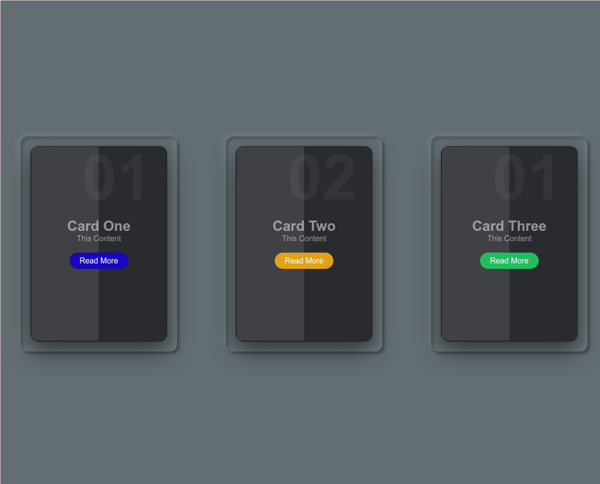
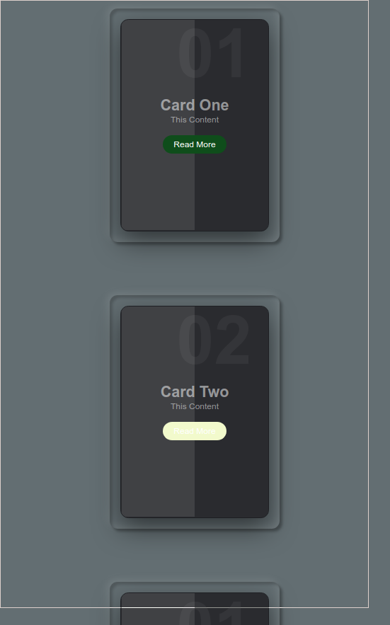

# 一个比较质感的卡片

[重写前作者](https://www.bilibili.com/video/BV1RF411z7wQ?spm_id_from=333.999.0.0)

## 预览图




## [预览](https://mekefly.github.io/quick-card-hover-effect/src/index.html)

## Quick Start

- 第一种:克隆仓库运行

1. 克隆
   > get clone git@github.com:mekefly/quick-card-hover-effect.git
2. 进入
   > cd quick-card-hover-effect
3. 打开 vscode
   > code .
4. 运行 index.html
   浏览器打开或使用`live Server`vscode 插件运行

- 第二种：方法直接复制源码放到 html 文件中运行便可

## 源码

```html
<!DOCTYPE html>
<html lang="en">
  <head>
    <meta charset="UTF-8" />
    <meta http-equiv="X-UA-Compatible" content="IE=edge" />
    <meta name="viewport" content="width=device-width, initial-scale=1.0" />
    <title>Document</title>
  </head>
  <body>
    <!-- 对代码进行编译为浏览器可识别的代码，这里使用了jsx -->
    <!-- https://www.babeljs.cn -->
    <script src="https://unpkg.com/@babel/standalone@7.17.11/babel.min.js"></script>
    <!-- vue框架，著名的前端框架 -->
    <!-- https://v3.cn.vuejs.org/ -->
    <script src="https://unpkg.com/vue@3.2.33/dist/vue.global.js"></script>
    <!-- css in ts的一个解决方案 -->
    <!-- https://wormery.github.io/wtsc/ -->
    <script src="https://unpkg.com/@wormery/wtsc@2.0.0-bate.38/dist/wtsc.iife.js"></script>
    <!-- <script src="https://unpkg.com/@wormery/wtsc@2.0.0-bate.38/dist/wtsc.iife.prod.js"></script> -->

    <div id="app"></div>

    <script type="text/babel">
      const { createApp, h, ref, computed, defineComponent } = Vue;

      //所有的标签会被babel解析为React.createElement()形似这样的函数，Vue中的h函数与createElement可以得到一样的参数，这样就生成了vue vnode
      const React = { createElement: h };

      const { defWTSC, rgb, px, PE, vh, vw, s, em } = wtsc;
      const wt = defWTSC({});

      ///global style
      const gw = wt.global();
      /** 居中*/
      const thisCenterClass = gw
        .clear()
        .add.position("absolute")
        .add.left(PE(50))
        .add.top(PE(50))
        .add.transform("translate(-50%,-50%)")
        .class("center")
        .out();

      const displayCenterClass = gw
        .clear()
        .add.display("flex")
        .add.justifyContent("center")
        .add.alignItems("center")
        .class("displayCenter")
        .out();

      gw.clear()
        .add.margin(px(0))
        .add.padding(px(0))
        .add.boxSizing("border-box")
        .add.fontFamily(["'Poppins'"], ["sans-serif"])
        .selector("*")
        .out();

      gw.clear()
        //center
        .add.display("flex")
        .add.justifyContent("center")
        .add.alignItems("center")

        .add.flexWrap("wrap")
        .add.minHeight(vh(100))
        .add.width(vw(100))
        .add.backgroundColor(rgb(99, 110, 114))
        .selector("body")
        .out();

      const w = wt.box;
      let borderRadiusSize = 15;
      const cardBoxContentProps = {
        serialNumber: { type: String, defalult: "" },
        title: { type: String, default: "" },
        content: { type: String, default: "" },
        href: { type: String, default: "" },
      };

      const CardBoxContent = defineComponent({
        name: "CardBoxContent",
        props: cardBoxContentProps,
        setup(props) {
          const w = wt.scoped("cardBoxContent");
          const color = rgb(255, 255, 255);
          return () => (
            <div style={w.add.padding(px(20)).add.textAlign("center").out()}>
              <h2
                style={w.add
                  .position("absolute")
                  .add.top(px(-10))
                  .add.right(px(30))
                  .add.fontSize(em(8))
                  .add.color(color.clone().setA(0.05))
                  .out()}
              >
                {props.serialNumber}
              </h2>
              <h3
                style={w.add
                  .fontSize(em(1.8))
                  .add.color(color.clone().setA(0.5))
                  .out()}
              >
                {props.title}
              </h3>
              <p
                style={w.add
                  .fontSize(em(1))
                  .add.color(color.clone().setA(0.5))
                  .out()}
              >
                {props.content}
              </p>
              <a
                style={w.add
                  .position("relative")
                  .add.display("inline-block")
                  .add.padding(px(8), px(20))
                  .add.marginTop(px(20))
                  .add.color(color)
                  .add.backgroundColor(
                    rgb(
                      Math.random() * 255,
                      Math.random() * 255,
                      Math.random() * 255
                    )
                  )
                  .add.borderRadius(px(100))
                  .add.textDecoration("none")
                  .add.fontWeight("100")
                  .out()}
                href={props.href}
              >
                Read More
              </a>
            </div>
          );
        },
      });
      const cardBoxProps = { ...cardBoxContentProps };
      const CardBox = defineComponent({
        name: "CardBox",
        props: cardBoxProps,
        setup(props) {
          const w = wt.scoped("cardBox");
          return () => (
            <div
              class={[
                w
                  .clear()
                  // 上左下右都向内伸缩一定距离
                  .add.position("absolute")
                  .add.top(px(20))
                  .add.left(px(20))
                  .add.bottom(px(20))
                  .add.right(px(20))
                  .add.backgroundColor("#2a2b2f")
                  .add.border(px(2), "solid", "#1e1f23")
                  .add.borderRadius(px(borderRadiusSize))
                  .add.boxShadow(0, px(20), px(50), rgb(0, 0, 0, 0.5))
                  .add.transition(s(0.5))
                  .add.overflow("hidden")
                  .class("cardBox")
                  .add.transform("translateY(-50px)")
                  .add.boxShadow(0, px(40), px(70), rgb(0, 0, 0, 0.5))
                  .pseudo(":hover")
                  .add.content("''")
                  .add.position("absolute")
                  .add.left(px(0))
                  .add.height(PE(100))
                  .add.width(PE(50))
                  .add.backgroundColor(rgb(255, 255, 255, 0.1))

                  .pseudo("::before")
                  .out(),
                displayCenterClass,
              ]}
            >
              <CardBoxContent {...props}></CardBoxContent>
            </div>
          );
        },
      });

      const cardProps = { ...cardBoxProps };
      const Card = defineComponent({
        name: "Card",
        props: cardProps,
        setup(props) {
          const w = wt.scoped("Card");
          return () => (
            <div
              style={w.add
                .position("relative")
                .add.minWidth(px(320))
                .add.height(px(440))
                .add.boxShadow(
                  //阴影暗面
                  ["inset", px(5), px(5), px(5), rgb(0, 0, 0, 0.2)],
                  //阴影亮面
                  ["inset", px(-5), px(-5), px(15), rgb(255, 255, 255, 0.1)],
                  //外侧暗面
                  [px(5), px(5), px(5), rgb(0, 0, 0, 0.3)],
                  //外测亮面
                  [px(-5), px(-5), px(15), rgb(255, 255, 255, 0.1)]
                )
                .add.borderRadius(px(borderRadiusSize))
                .out()}
            >
              <CardBox {...props}></CardBox>
            </div>
          );
        },
      });

      const App = defineComponent(function () {
        const w = wt.scoped("App");
        return () => (
          <div
            // class="displayCenter"
            style={w.add
              .display("flex")
              .add.justifyContent("center")
              .add.flexWrap("wrap")
              .out()}
          >
            <Card
              style={w.add.margin(px(50)).out()}
              serialNumber="01"
              title="Card One"
              content="This Content"
              href="#"
            ></Card>
            <Card
              style={w.add.margin(px(50)).out()}
              serialNumber="02"
              title="Card Two"
              content="This Content"
              href="#"
            ></Card>
            <Card
              style={w.add.margin(px(50)).out()}
              serialNumber="01"
              title="Card Three"
              content="This Content"
              href="#"
            ></Card>
          </div>
        );
      });

      createApp(App).mount("#app");
    </script>
  </body>
</html>
```
